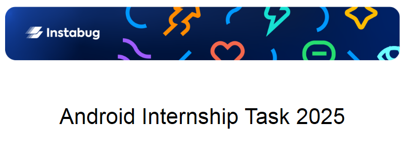

# Application Behaviour
## First launch:
The app request a location permission to get the current device `lat`,`lon` information
If it not granted for some reason, the application did **NOT** run and request to open settings and enable location permission for the app
If it granted the app make an API call to https://www.visualcrossing.com/ to get weather, then parse json and extract 5 forecast days to cache them into database
The API-calls are optimized by restrict the number of calls every 1H, so, if the time cache out did NOT expired, no new API calls even the user make pull-refresh, and get cached data instead.
**This optimization needed `if we run a large-scale app to make sure our backend din not fail because` of the number of requests, and also, the weather here won't change in an hour.**

# App Techs,Tools
<ol>
<li>Clean Architecture**</li>
<li>Material3</li>
<li>Compose</li>
<li>Kotlin</li>
<li>SQLite Database (""I'm NOT using Room because it considered to be 3rd party lib")</li>
<li>SharedPreferences(""I can go with DataStore for more optimization and read/write speed")</li>
<li>Manual DI (""I'm NOT using Dagger/Dagger-Hilt because all of then considered to be 3rd party libs")</li>
<li>Single Activity</li>
<li>ViewModels</li>
<li>CallBacks("Not AsyncTask because it's deprecated"") </li>
<li>Threading (""No Coroutines usage because it considered to be 3rd party lib")</li>
<li>LiveData</li>
<li>HttpUrlConnection</li>
<li>Compose Navigation</li>
</ol>

# App Screen Shots

